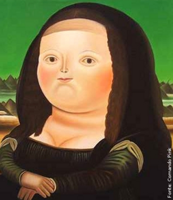

# Esteganografia com OpenCV 📷

Este projeto implementa uma técnica simples de esteganografia usando a biblioteca OpenCV em C++. A esteganografia é a arte de ocultar informações dentro de arquivos de mídia, neste caso, imagens. O programa esconde um texto dentro de uma imagem e é capaz de recuperá-lo posteriormente.

## Pré-requisitos 🛠️

Software instalados:
- C++ Compiler (GCC recomendado)
- OpenCV

## Linguagem Utilizada
Este projeto é desenvolvido em **C++**, utilizando a biblioteca OpenCV para manipulação de imagens.

## Instalação da GCC  (GNU Compiler Collection)  

```bash
sudo apt install build-essential
```

## Instalação da Biblioteca OpenCV 📚
OpenCV pode ser instalado usando o gerenciador de pacotes de sua escolha. Por exemplo, no Ubuntu, você pode instalar usando:

```bash
sudo apt-get install libopencv-dev
```

Este foi o meu caso, pois utilizei o WSL (Windows Subsystem for Linux). Mas, para outras plataformas, siga as instruções específicas de instalação do OpenCV para seu sistema operacional.

## Compilação do Projeto 🔨

Para compilar o programa, use os seguintes comandos no terminal:

```bash
g++ -o esconder_texto esconder_texto.cpp `pkg-config --cflags --libs opencv4`
```

```bash
g++ -o revelar_texto revelar_texto.cpp `pkg-config --cflags --libs opencv4`
```

Este comando compilará o código-fonte e linkará as bibliotecas necessárias do OpenCV.

## Executando o Programa 🚀

Para esconder o texto na imagem:

```bash
./esconder_texto
```

Este comando irá executar o programa que esconde um texto dentro de uma imagem especificada no código.

Para revelar o texto de uma imagem:

```bash
./revelar_texto
```

Este comando executa o programa que recupera o texto escondido da imagem.

## Como Funciona a Esteganografia? 🤫

Este projeto implementa a esteganografia de maneira simples:

- **Esconder Texto**: O texto é convertido em seu equivalente binário e armazenado nos canais de cores dos pixels da imagem, começando do topo esquerdo.
- **Revelar Texto**: Lê os valores dos canais de cores dos pixels da imagem para reconstruir o texto original.

## Observações Importantes 📝

- **Formato de Imagem**: Utilize imagens em formato **PNG** para evitar problemas. Imagens em formato **JPEG** podem causar erros devido à compressão que altera os valores dos pixels, o que pode corromper o texto escondido.
- **Tamanho do Texto**: O texto a ser escondido deve ser proporcional ao tamanho da imagem, considerando que cada caractere é armazenado em um canal de pixel.
- **Compartilhamento da imagem**: Uma vez que a imagem é gerada com o texto, é possível compartilhá-la sem perder os dados. No entanto, a imagem não deve ser convertida de PNG para outras extensões, pois isso pode corromper os dados, tornando impossível revelar o texto contido dentro da imagem. Testei compartilhando via WhatsApp (pede o dado quando não compartilhado como documento, porque a plataforma converte de PNG para JPEG).

## Imagem utilizada 




_A imagem escolhida foi a Monalisa, do artista Fernando Botero._ 